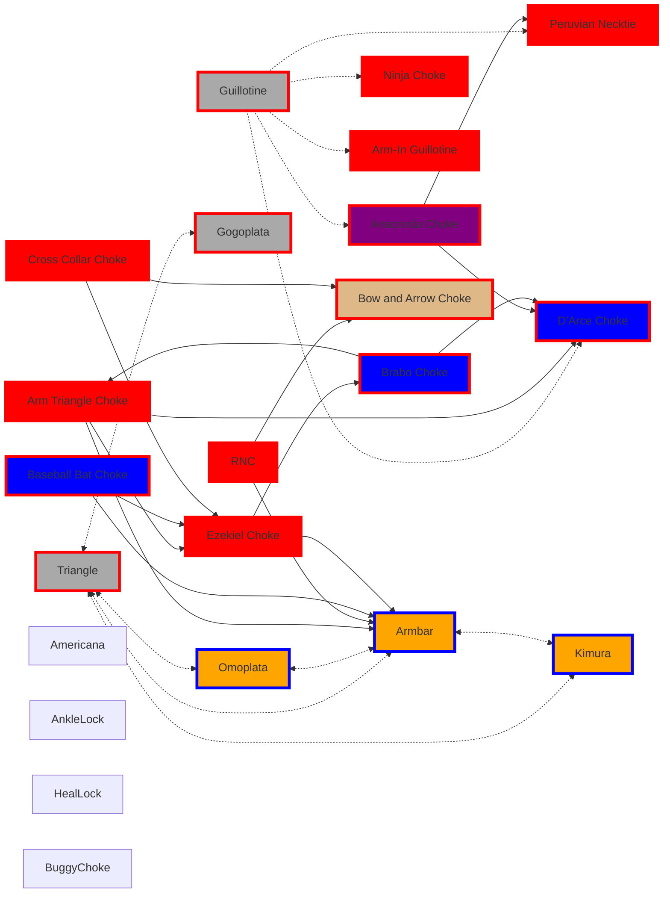

## Real World Guards & Submission Flow

> **Your body isn't solely your possession it is subject to everyone assuming you allow them to control and manipulate it. Focus on what you can control, but within that scope of control understand you can't control everything no matter how much you fight. Embrace the flow of control or the absence of control.**

#### Road to Third Strip
#todo/Personal/MMA/BAU
- [ ] Work on [[Framing]] & Closed Guard
- [ ] Focus on Guards against Bigger People
	- [ ] [[BJJ Priority Flows#Priority Open Guard Variations|Open Guard Variations]]
- [ ] Focus on Sweeps against Bigger People
	- [ ] [[BJJ Priority Flows#Purple - Open Guard Sweeps |Open Guard Sweeps]]
- [ ] Focus on Defense of [[BJJ Priority Flows#Top Submissions to Practice Countering and Escaping |Power Submissions]]
- [ ] Look into Knee-on-Belly and add stuff here
- [ ] Keep chin close to chest in general when person tries to get arm behind neck for control and keep you flat on black.


Guards not mentioned here can be risky in real-world scenarios where strikes are a factor. It’s important to move away from a reactive mindset and focus on being more proactive throwing in more aggression in your approach.

Submissions can serve as both sweeps and opportunities to transition to other submissions. Approach with the mindset that the opponent's limbs are obstacles; using submissions to manipulate their limbs can help create openings, especially for securing chokes.

### **Real-World Tips**
- **Distance Management:** Always use your legs to create space and control posture.
- **Safe Escapes:** Prioritize sweeps that lead to standing disengagements if in danger.
- **Adapt Quickly:** Switch guards based on the opponent's reactions and pressure.
### **Guards to Avoid in Real-World Scenarios**
- Deep Half Guard: Leaves face open to strikes.
- Inverted Guard: Risky against stomps or downward strikes.
- X-Guard: Vulnerable if opponent stays upright and strikes.

## All Guard Flow
Remember you always start off Standing

``` mehrmaid
flowchart LR
	A <-.-> KGuard
    A <-.-> B
    A <-.-> C
    A <-.-> D
    A <-.-> E
    A <-.-> H
    A <-.-> Q
    A <-.-> R
    A <-.-> ElevatorGuard
    B <-.-> C
    B --> F
    B --> G
    B <-.-> L
    B --> M
    B --> N
    B --> O
    B --> R
    B <-.-> ElevatorGuard
    C --> D
    C --> E
    C --> G
    C <-.-> ElevatorGuard
    Closed <-.-> A
	Closed --> OctopusGuard
	D --> F
	D --> N
	D --> Q
	D --> R
	D <-.-> ElevatorGuard
	D <-.-> OctopusGuard
	F --> N
	F <-.-> ElevatorGuard
	G <-.-> ElevatorGuard
	H <-.-> I
	H --> P
	H <-.-> Q 
	H --> R
	H <-.-> Z
	H <-.-> ElevatorGuard
	H <-.-> OctopusGuard
	H <-.-> Turtle
	I <-.-> J
	J --> N
	J <-.-> SMount
	K <-.-> Turtle
	L <-.-> C
	L --> F
	I <-.-> K
	I <-.-> OctopusGuard
	I <-.-> Turtle
	R <-.-> Q 
	R --> 1
	R --> 2
	R --> 3 
	R --> 4 
	Z <-.-> ElevatorGuard

	A[Full Guard] 
	B[De La Riva] 
	C[Spider]
	Closed[Closed Full Guard] 
	D[Butterfly]
	E[Lasso Guard]
	F[X]
	G[Collar/Sleeve]
	H[Half Guard] 
	I[Side Control] 
	J("[[Mount]]")
	K[North/South] 
	L[Reverse DeLaRiva] 
	M[Berimbolo]
	N[50/50]
	O[Worm]
	P[Tornado]
	Q[Rubber]
	R[Mission Control]
	Z[ZGuard]
	SMount[SMount]
	Turtle[Turtle]
	KGuard[KGuard]
	OctopusGuard[Octopus Guard]
	ElevatorGuard[Elevator Guard]
	
	1[Triangle]
	2[Gogoplata]
	3[Omoplata]
	4[Armbar]

style A fill:green,stroke:purple,stroke-width:4px,shadow:shadow

style B fill:blue,stroke:purple,stroke-width:4px,shadow:shadow

style C fill:blue,stroke:purple,stroke-width:4px,shadow:shadow

style D fill:blue,stroke:purple,stroke-width:4px,shadow:shadow

style E fill:blue,stroke:purple,stroke-width:4px,shadow:shadow

style F fill:blue,stroke:pink,stroke-width:4px,shadow:shadow

style G fill:blue,stroke:purple,stroke-width:4px,shadow:shadow

style H fill:green,stroke:orange,stroke-width:4px,shadow:shadow

style I fill:green,stroke:black,stroke-width:4px,shadow:shadow

style J fill:green,stroke:white,stroke-width:4px,shadow:shadow

style K fill:green,stroke:black,stroke-width:4px,shadow:shadow

style L fill:blue,stroke:Cyan,stroke-width:4px,shadow:shadow

style M fill:blue,stroke:black,stroke-width:4px,shadow:shadow

style N fill:blue,stroke:pink,stroke-width:4px,shadow:shadow

style O fill:blue,stroke:black,stroke-width:4px,shadow:shadow

style P fill:blue,stroke:Cyan,stroke-width:4px,shadow:shadow

style Q fill:blue,stroke:purple,stroke-width:4px,shadow:shadow

style R fill:blue,stroke:purple,stroke-width:4px,shadow:shadow

style Z fill:blue,stroke:black,stroke-width:4px,shadow:shadow

style 1 fill:darkgray,stroke:red,stroke-width:4px,shadow:shadow

style 2 fill:darkgray,stroke:red,stroke-width:4px,shadow:shadow

style 3 fill:coral,stroke:lime,stroke-width:4px,shadow:shadow

style 4 fill:coral,stroke:lime,stroke-width:4px,shadow:shadow

style Closed fill:teal,stroke:yellow,stroke-width:4px,shadow:shadow

style ElevatorGuard fill:blue,stroke:purple,stroke-width:4px,shadow:shadow

style KGuard fill:blue,stroke:black,stroke-width:4px,shadow:shadow

style OctopusGuard fill:blue,stroke:black,stroke-width:4px,shadow:shadow

style SMount fill:blue,stroke:white,stroke-width:4px,shadow:shadow

style Turtle fill:blue,stroke:White,stroke-width:4px,shadow:shadow

```

## Priority Guards to Sweeps
#### Purple - Open Guard Sweeps 
- Scissor Sweep
- Pendulum (Flower) Sweep
- Butterfly Sweep
- Balloon Sweep (Tomoe Nage)
- Lumberjack Sweep
- Arm Drag to Back Take Sweep
- Tripod Sweep

#### Yellow - Closed Guard Sweeps 
***Larger Opponents***
*Focus: Control their posture and attack openings*
- Hip Bump Sweep
- Double Ankle Sweep
- Knee Tap Sweep
- Homer Simpson Sweep
- Plan B Sweep
***Smaller Opponents***
*Use control and pressure to dominate.*
Transition to positions that maximize weight advantage.
- Push-Pull (Sit-Up) Sweep
- Sickle Sweep
- Double Ankle Sweep
- Plan B Sweep
#### Cyan - Inverted  Guard Sweeps 
- Helicopter Sweep
#### Orange - Half Guard Sweeps 
- Deep Half Guard Sweeps
- Knee Shield to Old School Sweep
- Half Guard Underhook Sweeps
#### Pink - Leg Entanglement Sweeps 
- X-Guard Sweep
- Shaolin Sweep

#### White - Turtle/Mount/SMount Guard Sweeps 
#todo/Personal/MMA/BAU 
- [ ] add sweeps from [[Turtle]] and [[Mount]]

``` mehrmaid
flowchart LR
    A[Full Guard] 
    B[De La Riva] 
    C[Spider]
    Closed[Closed Full Guard] 
    D[Butterfly]
    E[Lasso Guard]
    F[X]
	G[Collar/Sleeve]
	H[Half Guard] 
	I[Side Control] 
	J("[[Mount]]") 
	K[North/South] 
	L[Reverse DeLaRiva] 
	M[Berimbolo]
	N[50/50]
	O[Worm]
	P[Tornado]
	Q[Rubber]
	R[Mission Control]
	Z[ZGuard]
	SMount[SMount]
	Turtle[Turtle]
	KGuard[KGuard]
	OctopusGuard[Octopus Guard]
	ElevatorGuard[Elevator Guard]
	

	ArmDrag[ArmDrag]
	BalloonSweep[BalloonSweep]
	ButterflySweep[ButterflySweep]
	DeepHalfSweep[DeepHalfSweep]
	DoubleAnkleSweep[DoubleAnkleSweep]
	Flower[Flower]
	HalfGuardUnderhookSweep[HalfGuardUnderhookSweep]
	HelicopterSweep[HelicopterSweep]
	HipBump[HipBump]
	HomerSimpSweep[HomerSimpSweep]
	KneeTap[KneeTap]
	LumberJack[LumberJack]
	OldSchoolSweep[OldSchoolSweep]
	PlanBSweep[PlanBSweep]
	PushSweep[PushSweep]
	Scissor[Scissor]
	ShaolinSweep[ShaolinSweep]
	SickleSweep[SickleSweep]
	TripodSweep[TripodSweep]
	XSweep[XSweep]

	A --> ArmDrag
	A --> BalloonSweep
	A --> ButterflySweep
	A --> Flower
	A --> LumberJack
	A --> Scissor
	A --> TripodSweep
	
	Closed --> DoubleAnkleSweep
	Closed --> HipBump
	Closed --> HomerSimpSweep
	Closed --> KneeTap
	Closed --> SickleSweep
	Closed --> PlanBSweep
	Closed --> PushSweep
	
	F --> XSweep
	H --> DeepHalfSweep
	H --> HalfGuardUnderhookSweep
	H --> OldSchoolSweep
	L --> HelicopterSweep
	N --> ShaolinSweep 

	A <-.-> KGuard
    A <-.-> B
    A <-.-> C
    A <-.-> D
    A <-.-> E
    A <-.-> H
    A <-.-> Q
    A <-.-> R
    A <-.-> ElevatorGuard
    B <-.-> C
    B --> F
    B --> G
    B <-.-> L
    B --> M
    B --> N
    B --> O
    B --> R
    B <-.-> ElevatorGuard
    C --> D
    C --> E
    C --> G
    C <-.-> ElevatorGuard
    Closed <-.-> A
	Closed --> OctopusGuard
	D --> F
	D --> N
	D --> Q
	D --> R
	D <-.-> ElevatorGuard
	D <-.-> OctopusGuard
	F --> N
	F <-.-> ElevatorGuard
	G <-.-> ElevatorGuard
	H <-.-> I
	H --> P
	H <-.-> Q 
	H --> R
	H <-.-> Z
	H <-.-> ElevatorGuard
	H <-.-> OctopusGuard
	H <-.-> Turtle
	I <-.-> J
	I <-.-> OctopusGuard
	I <-.-> Turtle
	J --> N
	J <-.-> SMount 
	K <-.-> Turtle
	L <-.-> C
	L --> F
	I <-.-> K
	R <-.-> Q 
	Z <-.-> ElevatorGuard
	

style A fill:green,stroke:purple,stroke-width:4px,shadow:shadow

style B fill:blue,stroke:purple,stroke-width:4px,shadow:shadow

style C fill:blue,stroke:purple,stroke-width:4px,shadow:shadow

style D fill:blue,stroke:purple,stroke-width:4px,shadow:shadow

style E fill:blue,stroke:purple,stroke-width:4px,shadow:shadow

style F fill:blue,stroke:pink,stroke-width:4px,shadow:shadow

style G fill:blue,stroke:purple,stroke-width:4px,shadow:shadow

style H fill:green,stroke:orange,stroke-width:4px,shadow:shadow

style I fill:green,stroke:black,stroke-width:4px,shadow:shadow

style J fill:green,stroke:White,stroke-width:4px,shadow:shadow

style K fill:green,stroke:black,stroke-width:4px,shadow:shadow

style L fill:blue,stroke:Aqua,stroke-width:4px,shadow:shadow

style M fill:blue,stroke:black,stroke-width:4px,shadow:shadow

style N fill:blue,stroke:pink,stroke-width:4px,shadow:shadow

style O fill:blue,stroke:black,stroke-width:4px,shadow:shadow

style P fill:blue,stroke:Aqua,stroke-width:4px,shadow:shadow

style Q fill:blue,stroke:purple,stroke-width:4px,shadow:shadow

style R fill:blue,stroke:purple,stroke-width:4px,shadow:shadow

style Z fill:blue,stroke:black,stroke-width:4px,shadow:shadow

style Closed fill:teal,stroke:yellow,stroke-width:4px,shadow:shadow

style ElevatorGuard fill:blue,stroke:purple,stroke-width:4px,shadow:shadow

style KGuard fill:blue,stroke:black,stroke-width:4px,shadow:shadow

style OctopusGuard fill:blue,stroke:black,stroke-width:4px,shadow:shadow

style Turtle fill:blue,stroke:White,stroke-width:4px,shadow:shadow

style SMount fill:blue,stroke:White,stroke-width:4px,shadow:shadow


style ArmDrag fill:black,stroke:purple,stroke-width:4px,shadow:shadow

style BalloonSweep fill:purple,stroke:yellow,stroke-width:4px,shadow:shadow

style ButterflySweep fill:black,stroke:purple,stroke-width:4px,shadow:shadow

style DeepHalfSweep fill:black,stroke:orange,stroke-width:4px,shadow:shadow

style DoubleAnkleSweep fill:black,stroke:yellow,stroke-width:4px,shadow:shadow

style Flower fill:black,stroke:purple,stroke-width:4px,shadow:shadow

style HalfGuardUnderhookSweep fill:black,stroke:orange,stroke-width:4px,shadow:shadow

style HelicopterSweep fill:black,stroke:Cyan,stroke-width:4px,shadow:shadow

style HipBump fill:black,stroke:yellow,stroke-width:4px,shadow:shadow

style HomerSimpSweep fill:black,stroke:yellow,stroke-width:4px,shadow:shadow

style KneeTap fill:black,stroke:yellow,stroke-width:4px,shadow:shadow

style LumberJack fill:black,stroke:purple,stroke-width:4px,shadow:shadow

style OldSchoolSweep fill:black,stroke:orange,stroke-width:4px,shadow:shadow

style PlanBSweep fill:black,stroke:yellow,stroke-width:4px,shadow:shadow

style PushSweep fill:black,stroke:yellow,stroke-width:4px,shadow:shadow

style Scissor fill:black,stroke:purple,stroke-width:4px,shadow:shadow

style ShaolinSweep fill:black,stroke:pink,stroke-width:4px,shadow:shadow

style SickleSweep fill:black,stroke:yellow,stroke-width:4px,shadow:shadow

style TripodSweep fill:black,stroke:purple,stroke-width:4px,shadow:shadow

style XSweep fill:black,stroke:pink,stroke-width:4px,shadow:shadow

```


## Submission Flows
red border are chokes, blue borders limbs
- Open Guard - dark gray Chokes off back that can maybe used in other positions
- Side Control, Mount, Half Guard - Blue
- Sprawl, Turtle - Purple
- Back Control - burlywood

Consider [[Exposing Arm]] to get person to attack your arm and give you opportunity to sweep.


