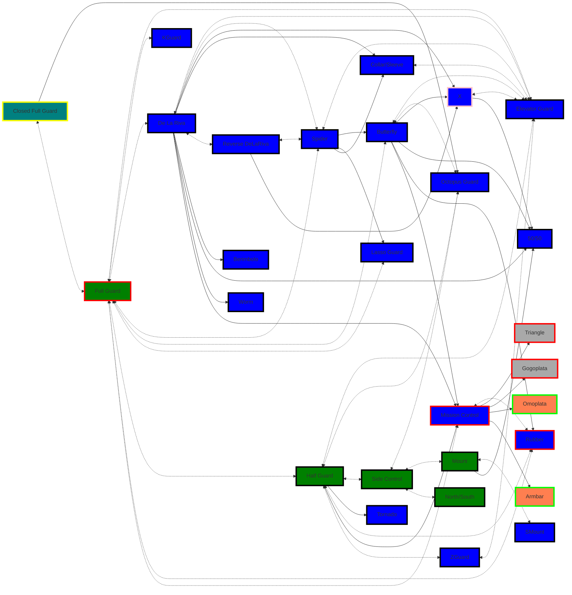
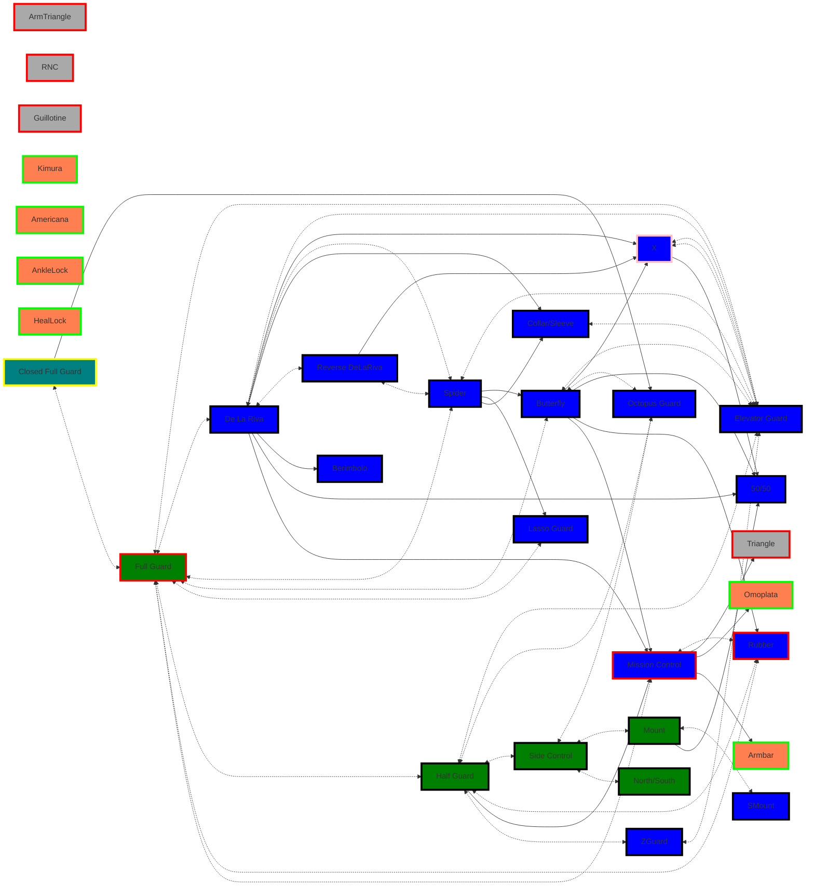
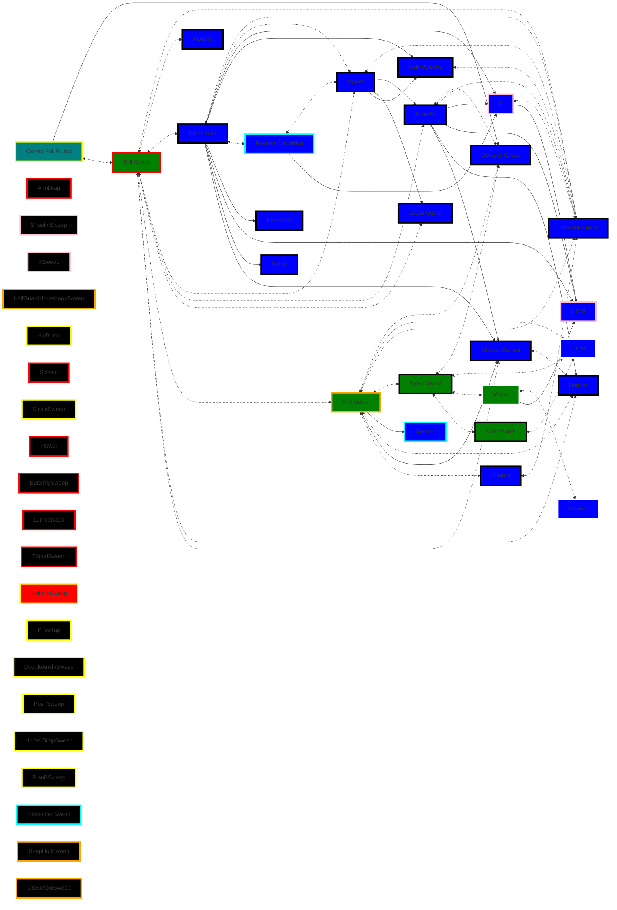
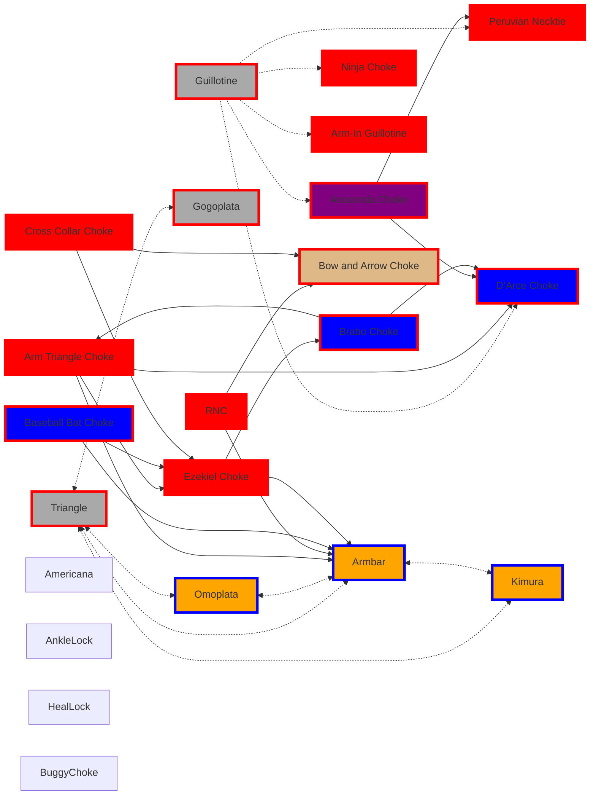

## Real World Guards & Submission Flow

> **Your body isn't solely your possession it is subject to everyone assuming you allow them to control and manipulate it. Focus on what you can control, but within that scope of control understand you can't control everything no matter how much you fight. Embrace the flow of control or the absence of control.**

Guards not mentioned here can be risky in real-world scenarios where strikes are a factor. It’s important to move away from a reactive mindset and focus on being more proactive throwing in more aggression in your approach.

Submissions can serve as both sweeps and opportunities to transition to other submissions. Approach with the mindset that the opponent's limbs are obstacles; using submissions to manipulate their limbs can help create openings, especially for securing chokes.

### **Real-World Tips**
- **Distance Management:** Always use your legs to create space and control posture.
- **Safe Escapes:** Prioritize sweeps that lead to standing disengagements if in danger.
- **Adapt Quickly:** Switch guards based on the opponent's reactions and pressure.
### **Guards to Avoid in Real-World Scenarios**
- Deep Half Guard: Leaves face open to strikes.
- Inverted Guard: Risky against stomps or downward strikes.
- X-Guard: Vulnerable if opponent stays upright and strikes.

## All Guard Flow
Remember you always start off Standing

## Priority Submission Flow
### Top Submissions to Practice Attacking (Positions Available: 7+)
- **Armbar (Straight Armbar)**
- **Guillotine Choke**
- **Rear Naked Choke (RNC)**
- **Triangle Choke**
- Try low in terms of positions
	- **Buggy Choke**
	- **Ezekiel Choke**
- **Arm Triangle**: Highly effective but with fewer positions to set up compared to others.
### Top Submissions to Practice Countering and Escaping
- **Kimura**
- **Americana**
- **Omoplata**

Look at [[Sub Counters]] & leverage [[Sub Tactics]]

#### **Guard Flow: Effective Against Larger Opponents**

##### **Guard Principles**
- Prioritize creating distance and breaking posture.
- Use leverage-based techniques to neutralize strength.
- Exploit gaps in their balance or mobility.

##### Priority Open Guard Variations
- [[De La Riva]] – Attack-oriented.
- [[Spider]] – Leverage control with legs and grips.
- [[Lasso]] – Control-oriented.
- [[Butterfly]] – Great for sweeps and controlling posture.
- [[Collar & Sleeve]] – Defensive, distance management.
##### Priority [[Half Guards  |Half Guard]]  Variations
- Deep Half Guard – Leverage-based, transitions to sweeps.
- Z-Guard – Strong knee shield; transition to leg attacks.

##### Priority Leg Entanglement Guard Variations
- [[X Guard]] – Attack legs or transition to sweeps.
- 50/50 Guard – Control-oriented.

##### Priority Inverted  Guard Variations
- Tornado Guard – Dynamic; transitions to sweeps.
- Reverse De La Riva – Attack-oriented, leads to inversions.

#### **Guard Flow: Effective Against Smaller Opponents**
##### Priority Pressure Guards
- Half Guard with Underhook – Pressure-heavy control.
- Lockdown Guard – Traps opponent’s leg for sweeps or transitions.

##### Top Guards (Dominant Positions)
- Mount Guard – Dominate and apply submissions.
- Top Turtle – Attack openings aggressively.

#### **Guard Flow Sub: Effective Against Larger Opponents**
##### Open Guard Submissions
- **Chokes:** Triangle, Guillotine, Rear Naked Choke, Arm Triangle.
- **Armbars:** Set up from leg control or collar grips.
##### Closed Guard Submissions
- **Chokes:** Triangle, Cross Collar, Ezekiel, Loop Choke, Bow and Arrow Choke.
- **Armlocks:** Kimura, Omoplata, Armbar, Americana.
##### Half Guard Submissions
- **Chokes:** Triangle, Cross Collar, Ezekiel, Loop Choke, Bow and Arrow Choke.
- **Armlocks:** Kimura, Omoplata, Americana.
##### Leg Entanglement Guard Submissions
- **Leg Locks:** Heel Hook, Straight Ankle Lock, Toe Hold, Knee Bar.

#### **Guard Flow Sub: Effective Against Smaller Opponents**
##### Pressure Guard Submissions
- **Pressure Submissions:** Americana, Wrist Locks.

##### Top Guard Submissions
- **Neck Cranks:** Can Opener, Twister (if legal).
- **Chokes:** D’Arce, Peruvian Necktie.

## Priority Guards to Sweeps
#### Red - Open Guard Sweeps 
- Scissor Sweep.
- Pendulum (Flower) Sweep.
- Butterfly Sweep.
- Balloon Sweep (Tomoe Nage).
- Lumberjack Sweep.
- Arm Drag to Back Take Sweep
- Tripod Sweep

#### Yellow - Closed Guard Sweeps 
***Larger Opponents***
Focus: Control their posture and attack openings.
- Hip Bump Sweep.
- Balloon Sweep (Tomoe Nage).
- Double Ankle Sweep
- Knee Tap Sweep
- Homer Simpson Sweep
- Plan B Sweep
***Smaller Opponents***
Use control and pressure to dominate.
Transition to positions that maximize weight advantage.
- Push-Pull (Sit-Up) Sweep
- Balloon Sweep
- Sickle Sweep
- Double Ankle Sweep
- Plan B Sweep
#### Cyan - Inverted  Guard Sweeps 
- Helicopter Sweep
#### Orange - Half Guard Sweeps 
- Deep Half Guard Sweeps
- Knee Shield to Old School Sweep
- Half Guard Underhook Sweeps.
#### Pink - Leg Entanglement Sweeps 
- X-Guard Sweep
- Shaolin Sweep

#### White - Turtle/Mount/SMount Guard Sweeps 
add sweeps from [[_Fitness/MMA/Grappling/BJJ/Untitled|Untitled]]

## Submission Flows
red border are chokes, blue borders limbs
- Open Guard - dark gray Chokes off back that can maybe used in other positions
- Side Control, Mount, Half Guard - Blue
- Sprawl, Turtle - Purple
- Back Control - burlywood

