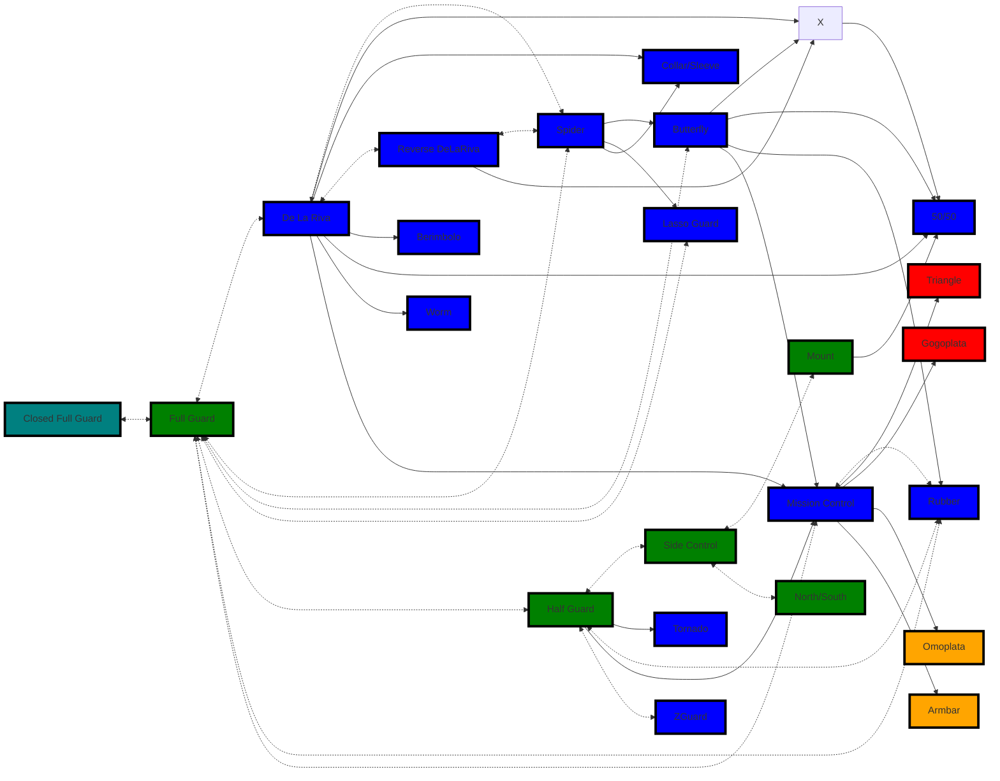
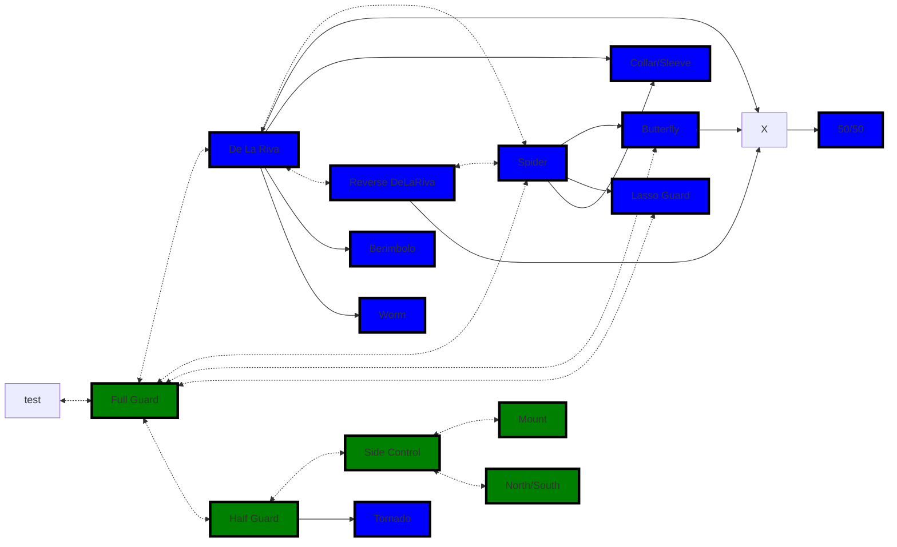
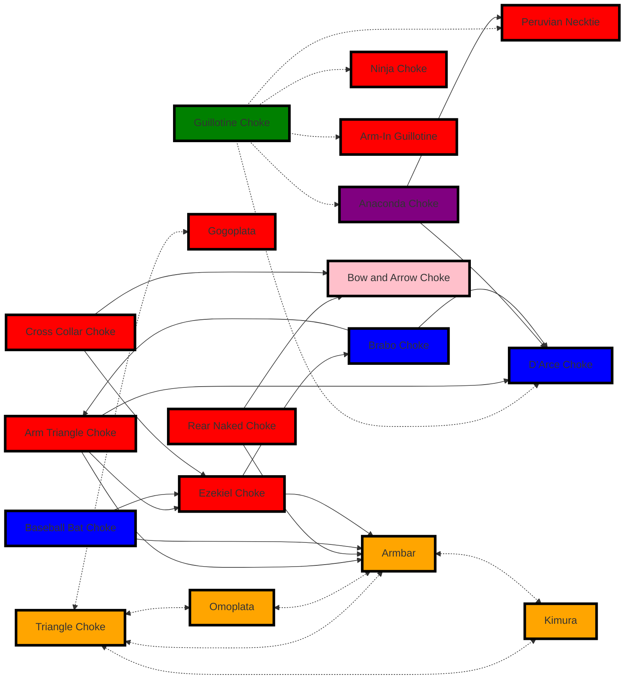

# Opponent Size Best Practices (Bottom Defensive Position)  

My default state in Jujitsu is reactive focus on being more proactive also incorporating more aggression.

**Rubber Guard**, **Closed Guard**, and **Butterfly Guard** equals chokes
chokes to limbs to choke
limbs to chokes to limb

use and create angles

x choke to triangle

Fake a submission for another submission or use for a sweep 

Reverse somebody's Kimura with an Armbar

Avoid inverting in general bad for neck and risky in terms of punches and kicks

Keep people hand low on collar  
  
  
Control hands vs solving hand problems

fight for inside try circling alternating inwards and outward flow while hand fighting be aware of grips on collar and neck

## BJJ Stretches
- Bird dog
	- ![[birdDog.gif]]
- Lock Clam
	- 
- Curl Up
	- 
- Hip Openers
	- ![[HipOpenerOne.gif]]
	- ![[HipOpenerTwo.gif]]
	- ![[HipOpenerThree.gif]]
- Bjj Movements
	- ![[BJJDynamicOne.gif]]
	- ![[BJJDynamicTwo.gif]]
	- ![[BJJDynamicThree.gif]]

## Guard Flow 
Don't necessarily need to start in full guard also any open guard can be used to get into mission control which is when you have a leg over the back of the neck holding with the opposite side arm and into Rubber guard

#todo/MMA
- [ ] Create one with practical guards assuming someone is kicking and punching

Sweeps

- Open Guard - Green
- Side Control, Mount, Half Guard - Blue
- Sprawl, Turtle - purple
- Back Control - Pink

## Effective Against Larger Opponents

### Guards 
Guards that create distance, use leverage, or exploit the opponent's size and strength against them:

1. **Open Guards**  Blue 
   - [[De La Riva]] - Attack-Oriented Guard
   - [[Spider]] - Attack-Oriented Guard
   - [[Lasso]] 
   - [[Butterfly]] 
   - [[Collar & Sleeve]]  - Defensive-Oriented guard

2. **[[Half Guards]]**  
   - Deep Half Guard  
   - ZGuard - Start with half guard knee shield at shoulder then switch to z guard at hip

3. **Leg Entanglements**  
   - Single-leg [[X Guard]] 
   - 50/50 Guard  

4. **Inverted Guards**  
   - Tornado Guard  
   - Reverse De La Riva - Attack-Oriented Guard

### Submissions
Techniques that leverage precision and joint manipulation rather than brute force:

1. **Chokes** - All chokes give you armbars
   - Triangle Choke  
   - Guillotine Choke  
   - Arm Triangle Choke (chain attack from side control or mount)
   - Rear Naked Choke  

2. **Arm Locks**  
   - Armbar  
   - Kimura (with proper leverage from side control, guard, or standing positions)
   - Omoplata  
   - Americana  

3. **Leg Attacks**  
   - Straight Ankle Lock  
   - Heel Hook  
   - Toe Hold  
   - Knee Bar (transition from leg entanglements)

## Effective Against Smaller Opponents

### Guards
Guards that allow control and pressure, benefiting from weight and strength advantages:

1. **[[Closed Guard]]**  - Defensive-Oriented guard
   - Standard Full Closed Guard  
   - High Guard  

2. **Pressure Guards**  
   - Half Guard with Underhook - Defensive-Oriented guard
   - Lockdown Guard  - lock legs in half guard

3. **Top Guards (Dominant Guards)**  
   - Mount Guard (transition from bottom)  
   - Top Turtle (attacking from dominant top position after breaking guard)  

### Submissions
Techniques that allow applying pressure or using body weight:

1. **Pressure Submissions**  
   - Ezekiel Choke (from mount or side control)  
   - Cross Collar Choke
   - Bow and Arrow Choke (from back control)  
   - Loop Choke (quick to execute during transitions)
   - D’Arce Choke (strong from side control or sprawl positions)
   - Peruvian Necktie (quick attack in scrambles)

2. **Arm Locks**  
   - Americana (from mount or side control)  
   - Armbar (with strength advantage)
   - Wrist Locks (subtle attacks from many positions)

3. **Neck Cranks (if allowed)**  
   - Can Opener  
   - Twister  

## Key Observations
- **Larger Opponents:** Focus on guards and submissions that neutralize their strength, limit mobility, and capitalize on openings. Leverage-based techniques like leg locks and chokes are highly effective.  
- **Smaller Opponents:** Use pressure-heavy guards and submissions that amplify your size advantage. Dominant positions like side control or mount are beneficial for transitioning to submissions.
- **Guard Play:** Choose guards that give you options to attack, sweep, or transition based on the opponent’s reactions.  
- **Opponent's Base**: Guards often flow based on your opponent’s balance and posture. For example, if they stand, you might switch to De La Riva or X-Guard; if they kneel, Butterfly or Half Guard is useful.  
- **Grip Fighting**: Guards that rely on grips (Spider, Lasso, Worm) flow into those with similar control mechanisms.  
- **Inversion**: Guards like De La Riva and Reverse De La Riva naturally flow into inverted positions like Berimbolo.  

