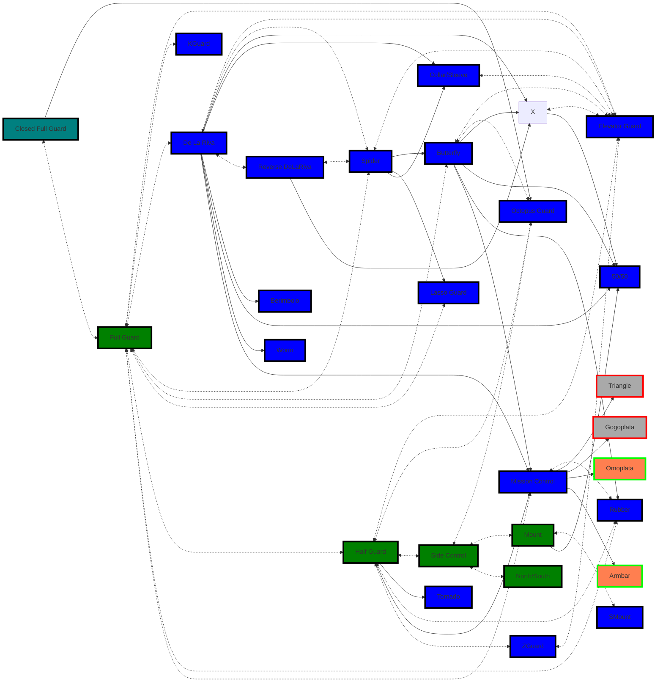
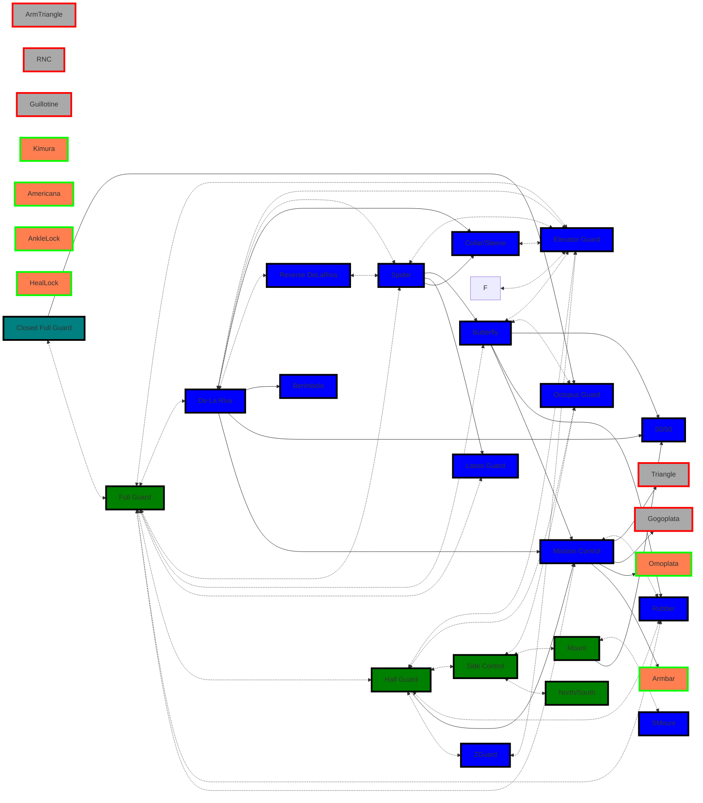
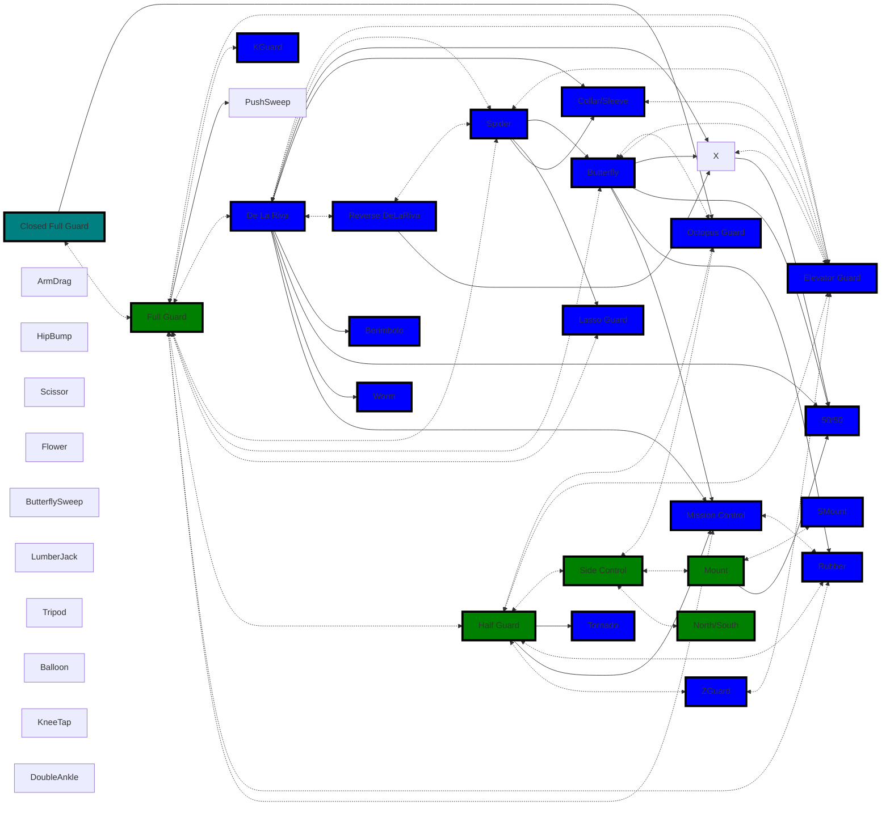
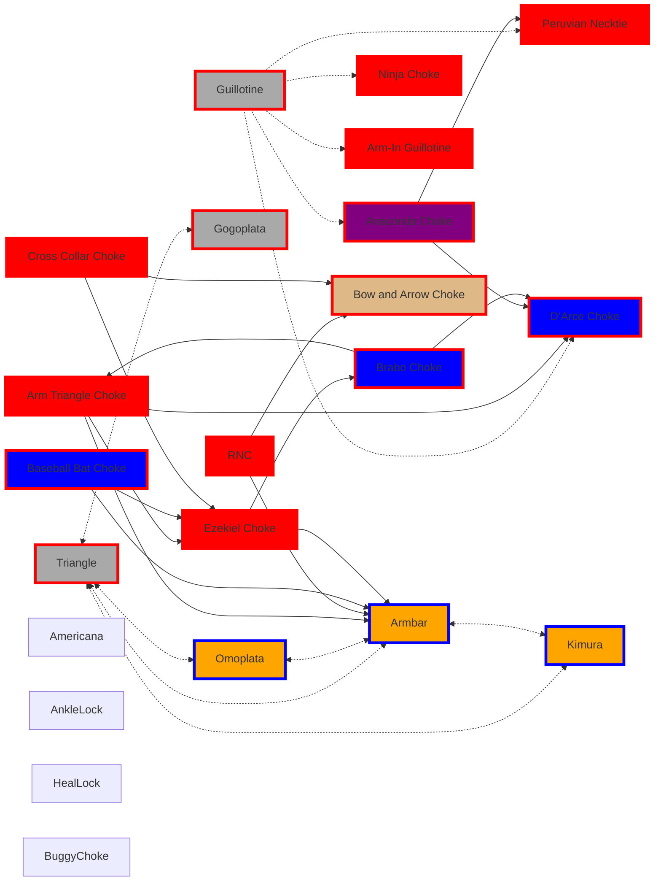

## All Guard Flow
Remember you always start off Standing

## Real World Guards & Submissions

My default state in Jujitsu is reactive focus on being more proactive also incorporating more aggression.

Submissions can be used as a form of sweep or used to create opportunity for other submission.

 **Avoid Inversions**: Inverting is risky for your neck and leaves you vulnerable to strikes in certain contexts.

**Avoid Kipping** as a first option—it can put you in bad positions. Opt for more stable transitions first.

### Hand Fighting Tips:
**Keep Hands Low on the Collar**: High grips can give your opponent more control over you.

**Control Hands vs. Solving Hand Problems**: Prioritize preventing grips and neutralizing their hands before solving grip issues.

- Fight for the inside position; it gives you better leverage and control.
- Use alternating inward and outward circling motions to break grips.
- Always monitor grips on your collar and neck—don’t let them dominate this space.

By focusing on proactive techniques, creating angles, and controlling key positions, you'll develop a more assertive and effective game plan.

### Effective Against Larger Opponents

## All Guards to Sweeps

## Submission Flows
red border are chokes, blue borders limbs
- Open Guard - dark gray Chokes off back that can maybe used in other positions
- Side Control, Mount, Half Guard - Blue
- Sprawl, Turtle - Purple
- Back Control - burlywood

