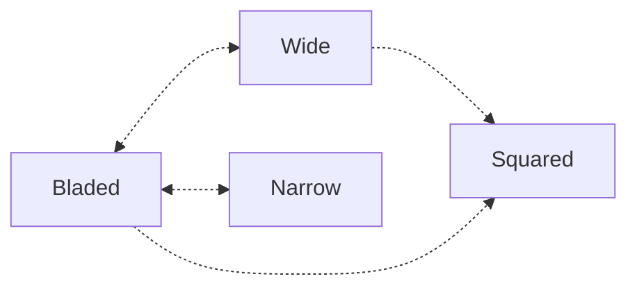

## **Fundamental Stances**:
- **Orthodox**: Lead with your left foot and hand.  ^b31948
- **Southpaw**: Lead with your right foot and hand.  ^1981b8

Be Aware of the difference of [[Orthodox vs Southpaw]] and what options open up when in one versus the other.
### **Strongest Position for Each Stance**
**Use feints to make your stance changes less obvious and more deceptive.**
Narrow and wide stances can be thought of as variations of the squared stance, primarily adjusting the distance between your feet. Also wide squared stance is good for hooks and uppercuts.

**Best Stance Transition Order**

### **Avoiding Strong Stances**
- Limit or avoid engaging when your opponent is in a strong stance to reduce the risk of counters.
- If you can’t see their punch, move in the opposite direction of their striking hand to create space and avoid the attack.
- Also be aware of [[Distance Management Tactics]] based on stance you ability to change distance is affected.

| Stance      | Orthodox Strongest Use                 | Southpaw Strongest Use                   |
| ----------- | -------------------------------------- | ---------------------------------------- |
| **Bladed**  | Long-range control, jab setups         | Outside angle against orthodox opponents |
| **Squared** | Mid-range versatility, power punches   | Close-range power and clinch exchanges   |
| **Wide**    | Base for powerful strikes, takedowns   | Exploiting gaps with left power strikes  |
| **Narrow**  | Mobility for closing or escaping range | Creating angles and feints               |

### **1. Bladed vs. Squared Stance**
- **Bladed Stance**:
	- Good stance for jabs and cross.
    - Ideal for evasion and defensive movement.
    - Reduces your target area, allowing for faster lateral movement.
    - Best for side-to-side movement, circling, or angling off.
    - Great for evading attacks while creating openings for counterattacks.
    - Faster for darting into range and retreating.
    - Works well for a hit-and-don’t-get-hit strategy.
    - The narrower stance makes pivots and weight transfers more fluid and efficient.
    
- **Squared Stance**:
    - Best for offense, with your belly button facing the opponent.
    - Enables quicker and more powerful kicks.
    - Makes it easier to catch body kicks due to better alignment with the opponent’s strikes.
    - Excellent for linear movements, such as advancing or retreating.
    - Provides stability for absorbing pressure or pushing forward aggressively.
    - Ideal for close-range exchanges where small steps matter.
    - The even stance allows for powerful, quick movements in any direction.

### **2. Narrow vs. Wide Stance**
- **Tight Narrow, Close-Foot Stance**:
    - Harder for opponents to read your movements.
    - Enhances feints, keeping your strikes unpredictable.
    - The narrow stance allows for quick entry and exit, enabling rapid adjustments.
    - Offers more freedom to pivot, shift, and create new angles, making it easier to outmaneuver your opponent.
    
- **Wide Stance**:
    - Provides stability and balance for power strikes but may telegraph movements more easily.
    - Ideal for close-range situations, especially when anticipating a takedown attempt. A wide stance helps you stay grounded by lowering your center of gravity, making it harder for your opponent to off-balance or take you down.

## Bladed Stance Strengths & Weaknesses 
A semi-bladed or fully bladed stance affects both offensive and defensive kicking dynamics. A heavily bladed stance enhances side kicks, oblique kicks, and certain spinning techniques by aligning the hips for quick, linear strikes. However, it reduces the speed and fluidity of round kicks, switch kicks, and rear kicks, as the hips must rotate further to generate force, making these attacks more telegraphed.  
  
Defensively, a bladed stance can compromise balance and stability, making it harder to check kicks or shift weight efficiently. The narrower stance limits the ability to react quickly to incoming leg kicks, as the lead leg is more exposed and the hips are less squared for immediate defensive adjustments.