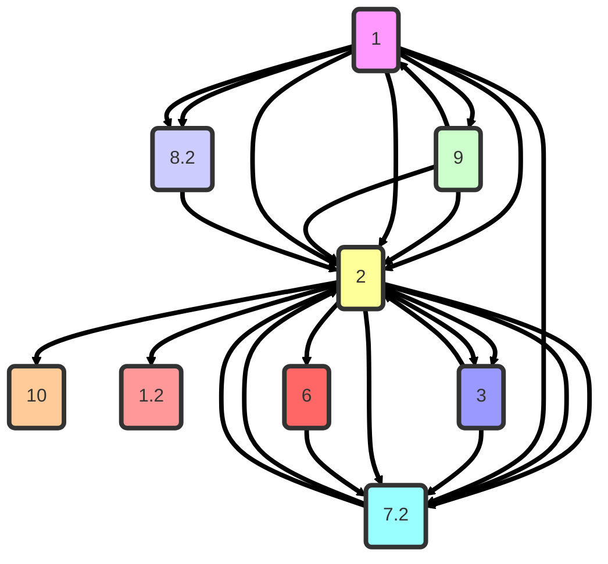

# The Key to Fluid Striking

Understanding how the mechanics and momentum of one strike naturally transition into the next is essential for fluid striking. This involves **retraction**, **rotation**, and **weight shifting**. 

Anything not listed might not have fit criteria in terms of open space striking context vs maybe something like clinch scenarios or not thought of

#todo/BAU/MMA/Drill
- [ ] Roll hook drill head hook both sides to body hook on roll down.  
- [ ] Rear kick to front teep push whole body forward into a knee coming from the rear then and with a kick with front leg.  
- [ ] Send back fist off of your kick getting cached and being thrown.

### **Striking Number System**

| Category              | Number | Strike                 |
| --------------------- | ------ | ---------------------- |
| **Punches**           | 1      | Jab                    |
|                       | 2      | Cross                  |
|                       | 3      | Lead Hook              |
|                       | 4      | Rear Hook              |
|                       | 5      | Lead Uppercut          |
|                       | 6      | Rear Uppercut          |
| **Elbows**            | 13     | Lead Elbow             |
|                       | 14     | Rear  Elbow            |
| **Lead Kicks**        | 7      | Lead Roundhouse        |
|                       | 8      | Lead Side Kick         |
|                       | 9      | Lead Teep              |
| **Switch Lead Kicks** | 7.1    | Lead Switch Roundhouse |
|                       | 8.1    | Lead Switch Side Kick  |
|                       | 9.1    | Lead Switch Teep       |
| **Rear Kicks**        | 7.2    | Rear Roundhouse        |
|                       | 8.2    | Rear Side Kick         |
|                       | 9.2    | Rear Teep              |
| **Switch Rear Kicks** | 7.3    | Rear Switch Roundhouse |
|                       | 8.3    | Rear Switch Side Kick  |
|                       | 9.3    | Rear Switch Teep       |
| **Knees**             | 10     | Lead Knee              |
|                       | 11     | Rear Knee              |
|                       | 12     | Flying Knee            |
| **Spinning Shit**     | 15     | Spinning Back Kick     |
|                       | 16     | Spinning Hook Kick     |
|                       | 17     | Spinning Back Elbow    |
|                       | 18     | Tornado Kick           |
|                       | 19     | Spinning Heel Kick     |

### Scenario 1 
![[open-stance.jpeg]]
#### Mirror Oppoisite Stance 
Anything mirror coming from the rear hand is tricky because limited angle and lean towards the power side of opponent

**Focus:** Target their open side and control angles. 
##### Either Opponent Orientation
- **1 → 2** (Jab → Cross)
- **1 → 7.2** (Jab → Rear Round Kick)
- **2 → 15** (Cross → Spinning Back Kick)
- **9 → 7.1** (Front Teep → Switch Round Kick)
- **3 → 7.2** (Lead Hook → Rear Round Kick)
- **3 → 6** (Lead Hook → Rear Uppercut)
- **6 → 3** (Rear Uppercut → Lead Hook)
- **7.2 → 2** (Rear Round Kick → Cross)
- **9 → 7.2** (Lead Teep → Rear Round Kick)
- **2 → 8.3** (Cross → Stance Switch Rear Side Kick)

> For switch rear side kick the lead foot will become back foot thrown in this scenario you can fake and throw front kick instead.

---

### Scenario 2
![[gettyimages-1332961304-612x612.jpg]]
#### Same Side Stance
##### Orthodox vs Orthodox or Southpaw vs Southpaw 
**Focus:** 
- Battle of lead hands and capitalize on openings in their guard for Orthodox vs Orthodox.
- Outmaneuver their lead hand and exploit rear-side openings for Southpaw vs Southpaw.

- **1 → 9** (Jab → Lead Teep Kick)
- **1 → 13** (Jab → Lead Elbow)
- **2 → 7** (Cross → Lead Round Kick)
- **1 → 1 → 2** (Double Jab → Rear Cross)
- **7.2 → 3** (Rear Low Kick → Lead Hook)
- **9 → 3** (Lead Teep Kick → Lead Hook)
- **7.2 → 7** (Rear Round Kick → Lead Round Kick)
- **1 → 1 → 2** (Double Jab → Rear Cross)
- **3 → 7.2** (Lead Hook → Rear Round Kick)

##### Southpaw vs Southpaw 
- **1 → 9.2** (Jab → Rear Teep Kick)

### Scenario 3

#### Multi Stance Orientation
##### Opposite Mirror or Same side Stance 
**Focus:** Works good for either stance orientation.

- **3 → 1** (Lead Hook → Jab)
- **1 → 7.2** (Jab → Rear Round Kick)
- **3 → 14** (Lead Hook → Rear Elbow)
- **9 → 1** (Lead Front Kick → Jab)

### Focus: Tight vs. Wide Punch Mechanics (Hooks and Uppercuts)

**Objective:** Improve striking fluidity, speed, and adaptability.

#### Key Concepts:
- **Wide Punches:**
    - Fully turn your shoulder when throwing a hook for maximum power and range.
    - Best for single, decisive shots when you want to generate impact.

- **Tight Punches:**
    - Minimize shoulder rotation to speed up recovery.
    - Allows for faster follow-up punches and smoother combos.

#### Drill Ideas:
**Transition Combos:**
    - Throw an uppercut, then a tight hook with minimal shoulder rotation for speed.
    - Reverse it: Start with a wide, powerful hook (full shoulder turn) and follow with a compact uppercut.

**Close-Range Adjustments:**
    - Practice chaining wide and tight punches to adapt to different ranges and angles.
    - Use wide punches to create openings and tight punches to exploit them quickly.

#### Tips for Fluidity:
- Coordinate your hips, shoulders, and feet to keep movements smooth and balanced.
- Avoid stiff, disconnected motions—make your punches feel like one continuous flow.
- Experiment with the rhythm of your punches, mixing power and speed.

#### Benefits:
- Faster and more efficient combinations.
- Greater adaptability to different fighting ranges.
- Unpredictable striking patterns that improve both offense and defense.

### Experiment

