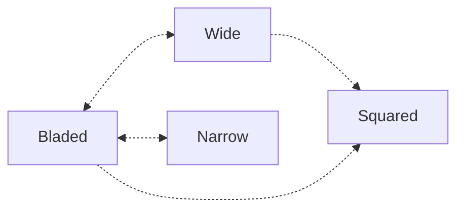

## **Stance**
**Best Stance Transition Order**

### **Strongest Position for Each Stance**
**Use feints to make your stance changes less obvious and more deceptive.**

|Stance|Orthodox Strongest Use|Southpaw Strongest Use|
|---|---|---|
|**Bladed**|Long-range control, jab setups|Outside angle against orthodox opponents|
|**Squared**|Mid-range versatility, power punches|Close-range power and clinch exchanges|
|**Wide**|Base for powerful strikes, takedowns|Exploiting gaps with left power strikes|
|**Narrow**|Mobility for closing or escaping range|Creating angles and feints|

### **1. Bladed vs. Squared Stance**
- **Bladed Stance**:
    - Ideal for evasion and defensive movement.
    - Reduces your target area, allowing for faster lateral movement.
    - Best for side-to-side movement, circling, or angling off.
    - Great for evading attacks while creating openings for counterattacks.
    - Faster for darting into range and retreating.
    - Works well for a hit-and-don’t-get-hit strategy.
    - The narrower stance makes pivots and weight transfers more fluid and efficient.
    
- **Squared Stance**:
    - Best for offense, with your belly button facing the opponent.
    - Enables quicker and more powerful kicks.
    - Makes it easier to catch body kicks due to better alignment with the opponent’s strikes.
    - Excellent for linear movements, such as advancing or retreating.
    - Provides stability for absorbing pressure or pushing forward aggressively.
    - Ideal for close-range exchanges where small steps matter.
    - The even stance allows for powerful, quick movements in any direction.

### **2. Narrow vs. Wide Stance**
- **Tight Narrow, Close-Foot Stance**:
    - Harder for opponents to read your movements.
    - Enhances feints, keeping your strikes unpredictable.
    - The narrow stance allows for quick entry and exit, enabling rapid adjustments.
    - Offers more freedom to pivot, shift, and create new angles, making it easier to outmaneuver your opponent.
    
- **Wide Stance**:
    - Provides stability and balance for power strikes but may telegraph movements more easily.
    - Ideal for close-range situations, especially when anticipating a takedown attempt. A wide stance helps you stay grounded by lowering your center of gravity, making it harder for your opponent to off-balance or take you down.