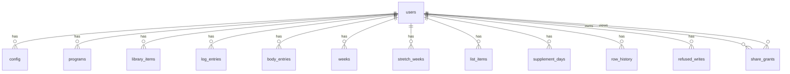

# Iron Log data model (Neon Postgres)

Design only, 2026-10-06. Migrations and data-access code are separate steps. Inputs: ADR 002 (Neon, database-first migrations), ADR 003 (versioned rows, tombstones, history, command per action), ADR 004 (own `users` table, RLS on `user_id`, Better Auth, share grants later), ADR 006 (pounds, `numeric` 4 dp), [[backend-data-rules]], `src/types.ts`, [[iron-log/docs/architecture/failure-modes/sync]].

## Design summary

```
Store:              Neon Postgres (ADR 002), database-first migrations
Normal form:        3NF for what the rules constrain; named exceptions below
Tables:             13 (12 in the first migration, share_grants later):
                    users, config, programs, library_items, log_entries, body_entries, weeks,
                    stretch_weeks, list_items, supplement_days, row_history, refused_writes, share_grants
Key strategy:       bigint identity PK on every table; UNIQUE(user_id, client_id) text for client-made ids
                    (client ids stay as they are, including legacy 'k<hash>'); no UUIDs
DB-enforced:        NOT NULL, FK (user_id, ON DELETE CASCADE so an account purge removes everything),
                    UNIQUE per user, CHECK for every limit in backend-data-rules.md section 6
App-enforced:       cross-row rules 2, 3, 7 (backend-data-rules.md section 3), stale-write refusal,
                    jsonb contents (shared TypeScript validate), all in one transaction per command
Indexes:            see list below
Lifecycle:          deleted_at tombstones, per-row version, per-user change counter, history >= 90 days
Deferred:           share_grants, partitioning (not needed), per-viewer read policies, tombstone purge job
```

Named exceptions to 3NF (all deliberate):
- `jsonb` for config, programs, week maps and a log entry's `sets`: always read and written whole, never queried inside by the server (user agreed). Each carries `schema_version`.
- `list_items` is one generic table for small id-keyed lists (stretches, stretch experiments, experiments, supplement items). They have no cross-row rules and are edited whole. The `list` column is a CHECK-constrained value, not a free string.

## Conventions on every synced table

| Column | Type | Notes |
|---|---|---|
| `id` | bigint identity | PK, server-only |
| `user_id` | bigint NOT NULL | FK to `users(id)` ON DELETE CASCADE; RLS keys on it; leading column of every unique and feed index |
| `client_id` | text NOT NULL | 1 to 100 chars; unique per user; absent where the natural key is the week or day |
| `version` | integer NOT NULL default 1 | server increments on every change (ADR 003) |
| `seq` | bigint NOT NULL | the user's change counter at the last change (the sync cursor) |
| `schema_version` | smallint NOT NULL default 1 | only on tables with a `jsonb` document |
| `created_at`, `updated_at` | timestamptz NOT NULL default now() | server time; the server orders things, never the phone's clock |
| `client_updated_at` | timestamptz NULL | the client's `updatedAt` claim, kept for the merge rules, never trusted for ordering |
| `deleted_at` | timestamptz NULL | tombstone; NULL means live |

**Sync cursor (agreed).** `users.change_seq` is bumped once per command, inside the same transaction, with `UPDATE users SET change_seq = change_seq + 1 WHERE id = $1 RETURNING change_seq`. Every row the command touches gets that value in `seq`. The feed is `WHERE user_id = $1 AND seq > $cursor ORDER BY seq` on each table. Cost accepted: one user's writes serialize on one row; irrelevant at this scale.

## ERD



Better Auth keeps its own tables in a separate `auth` schema (generated by its tool, not designed here). `users.auth_user_id` is the only link, which is the FM-19 single provider-id column.

## Tables

### users
| Column | Type | Notes |
|---|---|---|
| `id` | bigint identity | PK; the internal id every row points to |
| `auth_user_id` | text NOT NULL | UNIQUE; Better Auth's user id; the only provider reference |
| `is_admin` | boolean NOT NULL default false | the owner only |
| `change_seq` | bigint NOT NULL default 0 | the sync cursor counter |
| `created_at` | timestamptz NOT NULL default now() | |

Account deletion is a hard `DELETE`, so every child row, history row and refused write goes with it (CASCADE). No soft delete here.

### config
`user_id` UNIQUE (one row per user). `data jsonb NOT NULL` holds the settings object including `waterGoal` and `waterMode` from the supplements document, and the backup settings. Standard columns.

### programs
`key text NOT NULL CHECK (key IN ('A','B'))`, `data jsonb NOT NULL`. UNIQUE(`user_id`, `key`). Saved versions are in `library_items`, not here.

### library_items
`client_id`, `name text NOT NULL`, `from_key text CHECK (from_key IN ('A','B'))`, `saved_at timestamptz NOT NULL`, `auto boolean NOT NULL default false`, `created boolean NOT NULL default false`, `prog jsonb NOT NULL`. UNIQUE(`user_id`, `client_id`).

### log_entries
| Column | Type | Constraint |
|---|---|---|
| `client_id` | text NOT NULL | UNIQUE(`user_id`, `client_id`); legacy hash ids load here unchanged |
| `exercise_id` | text NOT NULL | 1 to 100 chars |
| `d` | date NOT NULL | CHECK between 1970-01-01 and 2200-12-31 |
| `phase` | text NULL | CHECK in `strength, iso, hyp, exp, mob` |
| `weight_lb` | numeric(9,4) NULL | CHECK `>= 0 AND < 5000` |
| `sets_count` | smallint NULL | CHECK 0 to 200 |
| `reps` | numeric(7,2) NULL | CHECK 0 to 1000 |
| `hold_sec` | numeric(8,2) NULL | CHECK 0 to 86400 |
| `sets` | jsonb NULL | per-set `w` (pounds), `r`, `sec`; at most 200; checked by the shared validator |
| `note` | text NULL | CHECK length <= 500 |
| `slot` | text NULL | slot id, 1 to 100 chars |
| `wk` | date NULL | the week's first day (Sunday; the code's `monday()` helper returns a Sunday); set when it differs from the date's week, always set for a check-off |
| `auto` | boolean NOT NULL default false | true for a check-off |

Row CHECK: `auto = false OR (slot IS NOT NULL AND wk IS NOT NULL)`.
Rule 1 (one check-off per card and week) is a partial unique index, below. Rules 2, 3 and 7 are app-enforced in the command transaction (a hand-logged session replaces the check-off; "same as last" once per card and week; either/or and untick cleanups).

### body_entries
`wk date NOT NULL`, `d date NOT NULL`, `weight_lb numeric(8,4) NOT NULL CHECK (weight_lb > 0 AND weight_lb < 1500)`. UNIQUE(`user_id`, `wk`) including tombstones: logging a deleted week again revives the same row (version bump, `deleted_at` cleared). No `client_id`; the week is the key.

### weeks
`week_start date NOT NULL`, `data jsonb NOT NULL` (prog, done, skipped, moved, ph, warm, rest, order, restOn, extra). UNIQUE(`user_id`, `week_start`). Standard columns.

### stretch_weeks
Same shape as `weeks`: `week_start date`, `data jsonb`; UNIQUE(`user_id`, `week_start`).

### list_items
`list text NOT NULL CHECK (list IN ('stretch','stretch_experiment','experiment','supplement_item'))`, `client_id`, `data jsonb NOT NULL`. UNIQUE(`user_id`, `list`, `client_id`). Stretch names being unique case-insensitively is a merge rule, enforced in the app, not here.

### supplement_days
`day date NOT NULL`, `water jsonb NOT NULL default '[]'` (ounces per drink), `boost jsonb`, `taken jsonb NOT NULL default '{}'`. UNIQUE(`user_id`, `day`). Water drink limit (above 0, up to 200 oz) is checked by the validator, not the schema.

### row_history
| Column | Type | Notes |
|---|---|---|
| `id` | bigint identity | PK |
| `user_id` | bigint NOT NULL | FK to `users` ON DELETE CASCADE |
| `table_name` | text NOT NULL | CHECK in the synced table names |
| `row_id` | bigint NOT NULL | the replaced row's `id` |
| `version` | integer NOT NULL | the version that was replaced |
| `data` | jsonb NOT NULL | full copy of the row |
| `replaced_at` | timestamptz NOT NULL default now() | what the pruning job ages off |

Written by one generic trigger on each synced table (BEFORE UPDATE), the only trigger in the design. Reason: a history row must exist for every change regardless of which writer touched the data, including your own admin SQL. Retention at least 90 days; a pruning job is a separate step. Size is the main risk against the 1 GB cap (FM-15).

### refused_writes
`user_id`, `command text NOT NULL`, `client_id text`, `reason text NOT NULL` (code), `payload jsonb` (scrubbed), `client_version text`, `received_at timestamptz NOT NULL default now()`. Read by the admin path across users. Not synced. Retention to be set when the closeout lists obligations.

### share_grants (later, not in the first migration)
`owner_id bigint NOT NULL`, `viewer_id bigint NOT NULL` (both FK to `users` CASCADE), `scope text NOT NULL`, `created_at`, `revoked_at timestamptz NULL`. UNIQUE(`owner_id`, `viewer_id`, `scope`) while not revoked (partial). The reader policy checks this table; owner-only RLS stays for writes.

## Indexes (first cut)

- `users(auth_user_id)` UNIQUE — session to user on every request.
- Every synced table `(user_id, seq)` — the change-feed pull and the full pull.
- `log_entries(user_id, client_id)` UNIQUE — idempotent create and edit by id.
- `log_entries(user_id, exercise_id, slot, wk) WHERE auto AND deleted_at IS NULL` UNIQUE — rule 1: one check-off per card and week.
- `log_entries(user_id, exercise_id, wk) WHERE deleted_at IS NULL` — rule 2, 3 and 7 lookups in the command transaction.
- `list_items(user_id, list, client_id)`, `library_items(user_id, client_id)`, `programs(user_id, key)`, `body_entries(user_id, wk)`, `weeks(user_id, week_start)`, `stretch_weeks(user_id, week_start)`, `supplement_days(user_id, day)` — UNIQUE keys, doubling as lookup indexes.
- `row_history(user_id, table_name, row_id, version)` — "show me the earlier versions of this row".
- `row_history(replaced_at)` — the pruning job.
- `refused_writes(received_at)` and `(user_id, received_at)` — admin monitoring.

No other indexes. At this volume (well under 100k rows) a per-exercise or per-date index would not earn its write cost; revisit with `index-tuning` once real plans exist.

## Row-level security (ADR 004)

- RLS is on for every table with `user_id`. Policy: `user_id = current_setting('app.user_id')::bigint`, set per transaction with `SET LOCAL`.
- The admin path uses a separate database role and a logged code path. It does not use a wildcard policy.
- Not verified: Neon's pooled connections in transaction mode. `SET LOCAL` inside a transaction should be fine, but test it first.

## Open items

- **Tombstone purge.** Tombstones must outlive the longest time a phone could be offline, or a stale phone resurrects a deleted row. Proposed window: the same 90 days as history; a phone offline longer does a full re-sync. Decide when the closeout lists obligations.
- **Refused-writes retention and scrubbing** (it can hold workout data).
- **Migration tool** (ADR 002: Knex fits Node; dbmate or Flyway for any language), chosen with decision 8.
- **`numeric` as string** in the Node driver (ADR 006): parse in the data-access layer.
- **Order of FM handoffs:** FM-05, 06, 08, 10, 15 are addressed above (tombstones revive or refuse, command transaction, version column, import by client id only, history size). FM-08 and FM-15 still need a restore test and a pruning job once built.
